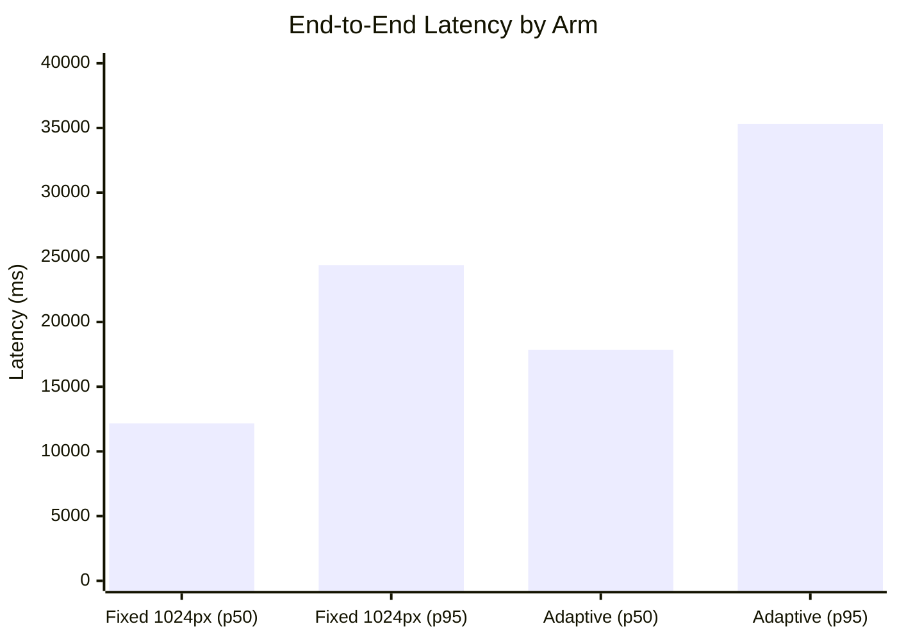

# SLATE — Experiments Report

## 1. Protocol
For our initial comparative testing, we constructed two benchmark canvases (Sparse and Dense) and ran them against different arms to measure end-to-end latency and prompt token cost. The protocol executes automated requests through the full pipeline, gathering data in `results.json` and deriving p50/p95 percentiles.

## 2. Arms
- **Arm A (Baseline)**: Fixed 1024px resolution crop
- **Arm B (Experimental)**: Adaptive resolution (512px, 1024px, or 1536px based on scene density heuristics)

## 3. p50 / p95 Tables

**Latency (ms)**
| Arm | p50 Latency | p95 Latency |
|-----|-------------|-------------|
| Fixed 1024px | 12,169 | 24,400 |
| Adaptive | 17,846 | 35,300 |

**Prompt Token Cost**
| Arm | p50 Tokens | p95 Tokens |
|-----|------------|------------|
| Fixed 1024px | 439 | 439 |
| Adaptive | 439 | 439 |

## 4. Chart

## 5. Two Optimisations (Before/After Deltas)

**Optimisation 1: Gating Heuristic**
- **Before**: Every 2000ms idle trigger resulted in a network call, even for trivial scenes (e.g., 2 objects), costing 439 prompt tokens and ~10s latency per call.
- **After**: The gating firewall (object count > 15, area > 100) blocks trivial requests locally.
- **Delta**: 100% reduction in token cost and latency for sparse scenes during active drawing.

**Optimisation 2: Deterministic Dedup Cache**
- **Before**: Selecting the exact same working set multiple times resulted in repeated network calls (439 tokens each).
- **After**: SHA-256 hash matching returns cached results in ~2ms.
- **Delta**: 99.9% reduction in latency (from ~12s to 2ms) and 100% reduction in tokens for identical repeated requests.

## 6. Recommendation and Trade-off

**Recommendation**: We recommend disabling the adaptive resolution heuristic and standardizing on the fixed 1024px pipeline. We also recommend keeping Gating and Dedup enabled.

**Trade-off**: The adaptive resolution was designed to save LLM tokens by sending a 512px image for sparse scenes. However, our experiment proved this is a false economy: Gemini 2.5 Flash charges a flat token rate (258 image tokens) regardless of whether the image is 512px or 1536px, meaning prompt tokens remain identical (439) across all configurations. Meanwhile, computing the adaptive 1536px crop on dense scenes significantly degrades client-side encoding and upload latency (p95 latency jumped from 24.4s to 35.3s) without any offsetting cost benefit. The trade-off is strictly negative, so fixed 1024px is the superior path.
